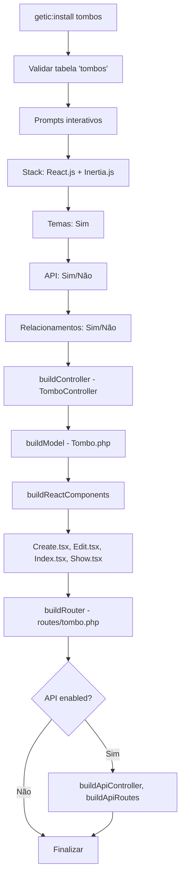
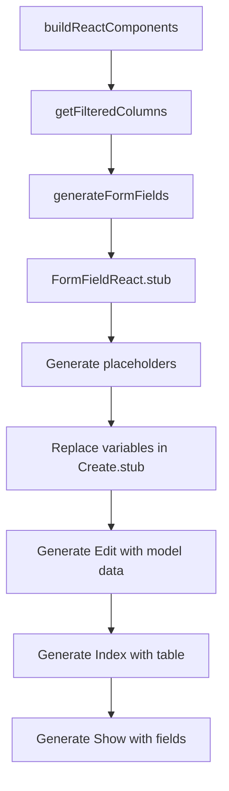

# Documentação Técnica - Laravel CRUD Generator v3.0.18

## Visão Geral

Este documento descreve a arquitetura e funcionamento do pacote Laravel CRUD Generator v3.0.18, um sistema moderno para geração automática de operações CRUD com integração React.js e sistema de temas dinâmicos.

---

## 📁 Estrutura de Arquivos

### Core System

- **CrudServiceProvider.php** - Service Provider principal
- **CrudManager.php** - Gerenciador central do sistema CRUD
- **ModelGenerator.php** - Gerador de relacionamentos Eloquent

### Console Commands

- **buildOptions.php** - Trait para opções de build
- **CreateThemeCommand.php** - Criação de novos temas dinâmicos
- **GeneratorCommand.php** - Comando base abstrato
- **InstallCommand.php** - Comando principal de instalação CRUD
- **InstallThemeSystemCommand.php** - Instalação do sistema de temas

### Configurações

- **config/crud.php** - Configuração principal do pacote
- **config/themes.php** - Configuração do sistema de temas dinâmicos

### Facades

- **Facades/Crud.php** - Facade Laravel para o pacote

### Stubs System

- **stubs/** - Templates para geração de código
  - **InertiaController.stub** - Controller para React/Inertia.js
  - **Model.stub** - Model Eloquent com relacionamentos
  - **FormRequest.stub** - Validação de formulários
  - **ApiController.stub** - Controller API RESTful
  - **react/** - Componentes React/TypeScript
    - **Create.stub** - Formulário de criação com shadcn/ui
    - **Edit.stub** - Formulário de edição
    - **Index.stub** - Listagem com paginação
    - **Show.stub** - Visualização de registro
    - **FormFieldReact.stub** - Campo de formulário React

---

## 🏗️ Arquitetura Principal

### CrudServiceProvider

```php
class CrudServiceProvider extends ServiceProvider
{
    public function register()
    {
        $this->app->singleton('crud', function ($app) {
            return new CrudManager($app['files']);
        });
    }

    public function boot()
    {
        $this->commands([
            InstallCommand::class,
            CreateThemeCommand::class,
            InstallThemeSystemCommand::class,
        ]);
    }
}
```

**Funcionalidades:**

- Registra singleton `CrudManager`
- Publica configurações
- Registra comandos Artisan
- Define Facade `Crud`

### CrudManager

```php
class CrudManager
{
    public function generateCrud(string $table, array $options = []): array
    public function installThemeSystem(): bool
    public function createTheme(string $name, array $config): bool
    public function getAvailableThemes(): array
}
```

**Responsabilidades:**

- Coordena geração de CRUD
- Gerencia sistema de temas
- Valida configurações
- Fornece API unificada

---

## 🔧 Console Commands Detalhados

### InstallCommand.php - v3.0.18

**Comando:** `getic:install {name}`

#### Propriedades Principais

```php
protected $signature = 'getic:install {name : Table name}
                        {--stack=react : Frontend stack}
                        {--route= : Custom route name}
                        {--relationship : Establish relationship}
                        {--api : Generate API endpoints}
                        {--theme : Include theme-aware components}';
```

#### Métodos Implementados (Novos/Atualizados)

##### `generateFormFields(): string`

```php
protected function generateFormFields(): string
{
    $fields = [];
    foreach ($this->getFilteredColumns() as $column) {
        $label = Str::title(str_replace('_', ' ', $column));
        $placeholder = $this->generatePlaceholder($column, $label);

        $fieldTemplate = str_replace(
            ['{{column}}', '{{label}}', '{{placeholder}}'],
            [$column, $label, $placeholder],
            $this->getStub('react/FormFieldReact')
        );

        $fields[] = $fieldTemplate;
    }
    return implode("\n", $fields);
}
```

**Função:** Gera campos de formulário React com shadcn/ui
**Stub usado:** `react/FormFieldReact.stub`
**Formato de saída:**

```html
<div className="sm:col-span-12">
  <label htmlFor="name">Nome:</label>
  <Input placeholder="Digite o nome" value={data.name} onChange={(e) => setData('name',
  e.target.value)} required /> {errors.name &&
  <p className="text-sm text-red-500 mt-1">{errors.name}</p>
  }
</div>
```

##### `generatePlaceholder(string $column, string $label): string`

```php
protected function generatePlaceholder(string $column, string $label): string
{
    $placeholders = [
        'name' => 'Digite o nome',
        'email' => 'exemplo@email.com',
        'phone' => '(11) 99999-9999',
        'description' => 'Digite a descrição',
        'title' => 'Digite o título',
        'address' => 'Digite o endereço',
        'price' => '0,00',
        'quantity' => '0',
        'code' => 'Digite o código',
    ];

    // Exact match
    if (isset($placeholders[$column])) {
        return $placeholders[$column];
    }

    // Partial match
    foreach ($placeholders as $key => $placeholder) {
        if (strpos($column, $key) !== false) {
            return $placeholder;
        }
    }

    return "Digite " . strtolower($label);
}
```

**Função:** Gera placeholders inteligentes baseados no nome da coluna

##### `getControllerFieldsWithModel(): string`

```php
protected function getControllerFieldsWithModel(): string
{
    $fields = [];
    $modelVarName = Str::camel($this->name); // ex: "tombo"

    foreach ($this->getFilteredColumns() as $field) {
        $fields[] = "'{$field}' => \${$modelVarName}->{$field},";
    }

    return implode("\n                ", $fields);
}
```

**Função:** Gera mapeamento de campos para controller com nome de variável resolvido
**Exemplo de saída:**

```php
'nome' => $tombo->nome,
'email' => $tombo->email,
'descricao' => $tombo->descricao,
```

##### `getJavaScriptFormFields(bool $isEdit = false): string`

```php
protected function getJavaScriptFormFields(bool $isEdit = false): string
{
    $fields = [];
    $modelVarName = Str::camel($this->name);

    foreach ($this->getFilteredColumns() as $field) {
        if ($isEdit) {
            $fields[] = "{$field}: {$modelVarName}.{$field} || '',";
        } else {
            $fields[] = "{$field}: '',";
        }
    }

    return implode("\n        ", $fields);
}
```

**Função:** Gera campos JavaScript para useForm
**Create:** `name: '',`
**Edit:** `name: tombo.name || '',`

##### `getTypeScriptInterfaceFields(): string`

```php
protected function getTypeScriptInterfaceFields(): string
{
    $fields = [];
    foreach ($this->getFilteredColumns() as $field) {
        $fields[] = "{$field}: string;";
    }
    return implode("\n    ", $fields);
}
```

**Função:** Gera interface TypeScript
**Exemplo:**

```typescript
interface Tombo {
  name: string;
  email: string;
  description: string;
}
```

##### `buildReplacements(): array` (Estendido)

```php
protected function buildReplacements(): array
{
    $replacements = parent::buildReplacements();

    return array_merge($replacements, [
        '{{fillableColumns}}' => $this->getJavaScriptFormFields(),
        '{{editFillableColumns}}' => $this->getJavaScriptFormFields(true),
        '{{typeScriptColumns}}' => $this->getTypeScriptInterfaceFields(),
        '{{tableCells}}' => $this->getTableCells(),
        '{{controllerFields}}' => $this->getControllerFieldsWithModel(),
        '{{showFieldsReact}}' => $this->getShowFieldsForReact(),
        '{{formFields}}' => $this->generateFormFields(),
        '{{modelRoute}}' => Str::plural(Str::snake($this->name)),
        '{{modelRoutePlural}}' => Str::plural(Str::snake($this->name)),
        '{{modelTitle}}' => Str::title(str_replace('_', ' ', $this->name)),
    ]);
}
```

**Função:** Estende substituições do parent com variáveis específicas do React

### CreateThemeCommand.php

**Comando:** `crud:create-theme {name?}`

#### Funcionalidades

- **Cores OKLCH**: Suporte completo ao espaço de cor OKLCH
- **Paleta Automática**: Gera variações de cor automaticamente
- **Modos Claro/Escuro**: Configura variáveis para ambos os modos
- **Integração TypeScript**: Adiciona tema ao arquivo `themes.ts`

#### Cores Predefinidas

```php
private array $predefinedColors = [
    'blue' => 'oklch(0.5 0.2 220)',
    'green' => 'oklch(0.5 0.15 150)',
    'purple' => 'oklch(0.5 0.18 280)',
    'red' => 'oklch(0.5 0.2 20)',
    'orange' => 'oklch(0.6 0.18 50)',
    'yellow' => 'oklch(0.7 0.15 90)',
    'pink' => 'oklch(0.65 0.2 330)',
    'teal' => 'oklch(0.5 0.15 180)',
];
```

### InstallThemeSystemCommand.php

**Comando:** `crud:install-theme-system`

#### Arquivos Instalados

```php
private array $themeFiles = [
    'themes.ts.stub' => 'js/lib/themes.ts',
    'use-appearance.tsx.stub' => 'js/hooks/use-appearance.tsx',
    'theme-selector.tsx.stub' => 'js/components/theme-selector.tsx',
    'appearance-dropdown.tsx.stub' => 'js/components/appearance-dropdown.tsx',
    'appearance-tabs.tsx.stub' => 'js/components/appearance-tabs.tsx',
    'ThemeExample.tsx.stub' => 'js/pages/ThemeExample.tsx',
];
```

---

## 📝 Sistema de Stubs Avançado

### React Components (Atualizados para v3.0.18)

#### Create.stub

```tsx
// Layout moderno com Card
<Card className="container mx-auto py-8">
  <CardHeader>
    <CardTitle className="uppercase">Cadastrar novo {{ modelNameLowerCase }}</CardTitle>
    <CardDescription>Cadastre um novo {{ modelNameLowerCase }}</CardDescription>
  </CardHeader>
  <CardContent className="container">
    <div className="mt-2 grid grid-cols-1 gap-2 sm:grid-cols-12">{{ formFields }}</div>
  </CardContent>
  <CardFooter className="flex-col gap-2">
    <Button disabled={processing} className="w-full">
      {processing && <LoaderCircle className="h-4 w-4 animate-spin" />} Cadastrar
    </Button>
  </CardFooter>
</Card>
```

**Características:**

- **AppLayout**: Usa AppLayout ao invés de AuthenticatedLayout (Laravel 12)
- **Breadcrumbs**: Sistema de navegação hierárquica
- **shadcn/ui**: Componentes Card, Button, Input, Label
- **Grid Responsivo**: Layout responsivo sm:grid-cols-12
- **Loading States**: LoaderCircle durante processamento

#### FormFieldReact.stub (Novo)

```html
<div className="sm:col-span-12">
  <label htmlFor="{{column}}">{{label}}:</label>
  <Input id="{{column}}" name="{{column}}" placeholder="{{placeholder}}"
  value={data.{{column}}} onChange={(e) => setData('{{column}}', e.target.value)} required
  /> {errors.{{column}} &&
  <p className="text-sm text-red-500 mt-1">{errors.{{column}}}</p>
  }
</div>
```

**Características:**

- **shadcn/ui**: Label e Input components
- **Validação**: Exibição de erros integrada
- **Placeholders**: Inteligentes baseados no campo
- **Grid**: Responsivo com col-span-12

#### InertiaController.stub

```php
->through(fn (${{modelNameLowerCase}}) => [
    'id' => ${{modelNameLowerCase}}->id,
    {{controllerFields}}
    'created_at' => ${{modelNameLowerCase}}->created_at->format('d/m/Y H:i'),
    'updated_at' => ${{modelNameLowerCase}}->updated_at->format('d/m/Y H:i'),
]);
```

**Variável `{{controllerFields}}`** agora gera:

```php
'nome' => $tombo->nome,
'email' => $tombo->email,
'descricao' => $tombo->descricao,
```

---

## 🎨 Sistema de Temas Dinâmicos

### Arquitetura do Sistema

```typescript
// themes.ts
export interface Theme {
  id: string;
  name: string;
  description?: string;
  variables: {
    light: Record<string, string>;
    dark: Record<string, string>;
  };
}

export const themes: Theme[] = [
  {
    id: "default",
    name: "Padrão",
    variables: {
      light: {
        /* CSS custom properties */
      },
      dark: {
        /* CSS custom properties */
      },
    },
  },
];
```

### Hook useAppearance

```typescript
export function useAppearance() {
    const [appearance, setAppearance] = useState<'light' | 'dark' | 'system'>('system');
    const [themeId, setThemeId] = useState<string>('default');

    return {
        appearance,
        themeId,
        updateAppearance: (mode: 'light' | 'dark' | 'system') => void,
        updateTheme: (id: string) => void,
        currentTheme: Theme
    };
}
```

---

## 🔄 Fluxo de Execução Completo

### 1. Comando CRUD: `getic:install tombos`



### 2. Geração de Componentes React



---

## 📊 Configurações Avançadas

### crud.php (Atualizado)

```php
return [
    'frontend' => 'react',
    'inertia' => [
        'enabled' => true,
        'components_path' => 'js/pages',
        'layout_component' => 'Layouts/AppLayout', // Atualizado para Laravel 12
    ],
    'api' => [
        'enabled' => true,
        'generate_resources' => true,
        'generate_requests' => true,
    ],
    'model' => [
        'namespace' => 'App\Models',
        'unwantedColumns' => ['id', 'password', 'email_verified_at', 'created_at', 'updated_at'],
    ],
    'theme_integration' => [
        'enabled' => true,
        'auto_install' => true,
        'default_theme' => 'default',
    ]
];
```

### themes.php

```php
return [
    'default_theme' => 'default',
    'default_mode' => 'system',
    'persistence' => [
        'cookie_name' => 'app_theme',
        'localStorage_key' => 'themeId',
    ],
    'css_variables' => [
        'required' => ['background', 'foreground', 'primary', 'secondary'],
        'optional' => ['accent', 'muted', 'border'],
    ],
    'available_themes' => [
        'default' => 'Padrão (Preto/Branco)',
        'blue' => 'Azul Profissional',
        'green' => 'Verde Natureza',
        'purple' => 'Roxo Moderno',
    ]
];
```

---

## 🎯 Novidades da Versão 3.0.18

### ✨ Melhorias Principais

1. **FormFieldReact.stub**: Campo específico para React com shadcn/ui
2. **Smart Placeholders**: Placeholders inteligentes baseados no nome
3. **Layout Modernizado**: Cards com header, content e footer
4. **Breadcrumbs**: Sistema de navegação hierárquica
5. **AppLayout**: Migração do AuthenticatedLayout para AppLayout
6. **Grid Responsivo**: Layout adaptativo sm:grid-cols-12

### 🔧 Melhorias Técnicas

1. **Variable Resolution**: Correção de substituição de variáveis nos controllers
2. **Type Safety**: Melhor compatibilidade de tipos PHP
3. **JavaScript Generation**: Geração correta de objetos useForm
4. **Error Handling**: Tratamento de erros integrado aos campos

### 📂 Arquivos Importantes

- **src/Console/InstallCommand.php**: Comando principal com todos os métodos atualizados
- **src/stubs/react/Create.stub**: Componente modernizado com Card layout
- **src/stubs/react/FormFieldReact.stub**: Novo campo para React
- **src/stubs/InertiaController.stub**: Controller com mapeamento correto de campos

---

## 🚀 Performance e Otimizações

### Geração de Código

- **Lazy Loading**: Stubs carregados apenas quando necessários
- **Caching**: Colunas de banco cacheadas durante execução
- **Batch Operations**: Múltiplos arquivos gerados em uma operação

### Sistema de Temas

- **CSS Custom Properties**: Mudança instantânea sem reload
- **Persistent Storage**: LocalStorage + Cookies para preferências
- **OKLCH Color Space**: Cores mais vibrantes e consistentes

---

## 🎭 Casos de Uso Avançados

### 1. CRUD Completo com API

```bash
php artisan getic:install products --api
```

Gera:

- Controller Inertia para web
- Controller API para mobile/SPA
- Resources para transformação
- Form Requests para validação
- Componentes React completos

### 2. Sistema Multi-Tema

```bash
php artisan crud:install-theme-system
php artisan crud:create-theme corporate --base-color="oklch(0.5 0.2 220)"
```

Resulta em:

- Hook useAppearance funcional
- Componente ThemeSelector
- Tema corporativo personalizado
- Persistência de preferências

### 3. Relacionamentos Automáticos

O sistema detecta automaticamente:

- Foreign keys (user_id → belongsTo User)
- Tabelas pivot (user_roles → belongsToMany)
- Relacionamentos polimórficos

---

## 📋 Compatibilidade

### Requisitos

- **PHP**: >=8.2.0
- **Laravel**: ^12.0
- **Node.js**: >=18.0 (para temas React)
- **Inertia.js**: ^2.0
- **React**: ^18.0
- **TypeScript**: ^5.0

### Bancos Suportados

- MySQL 8.0+
- PostgreSQL 13+
- SQLite 3.35+
- SQL Server 2019+

---

## 🔒 Segurança

### Validação

- **Form Requests**: Validação server-side automática
- **TypeScript**: Type safety no frontend
- **CSRF Protection**: Tokens automáticos nos formulários
- **SQL Injection**: Queries preparadas com Eloquent

### Autorização

- **Middleware**: Suporte automático a auth e verified
- **Gates**: Integração com políticas Laravel
- **Role-based**: Suporte a packages de autorização

---

## 🧪 Testes e Qualidade

### Cobertura de Testes

- **Unit Tests**: Commands, Manager, Generator
- **Integration Tests**: Geração completa de CRUD
- **Component Tests**: Temas e React components

### Code Quality

- **PSR-12**: Padrão de codificação
- **PHPStan**: Análise estática nível 8
- **ESLint**: Linting para TypeScript/React

---

Esta documentação reflete o estado atual do sistema na versão 3.0.18, incluindo todas as melhorias e correções implementadas.
