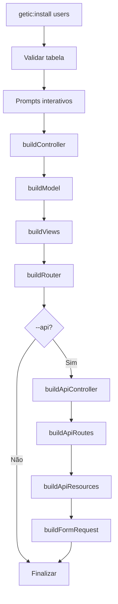
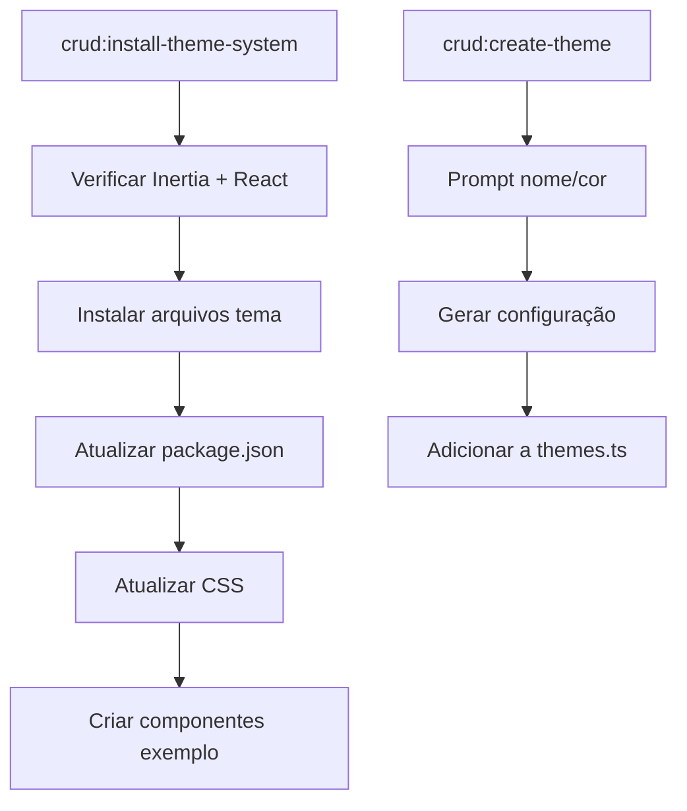

# Documentação Técnica - Laravel CRUD Generator v3.0.6

## Visão Geral

Este documento descreve a arquitetura e funcionamento do pacote Laravel CRUD Generator v3.0.6, um sistema moderno para geração automática de operações CRUD com integração React.js e sistema de temas dinâmicos.

---

## 📁 Estrutura de Arquivos Analisados

### Console Commands

- buildOptions.php - Trait para opções de build
- CreateThemeCommand.php - Criação de novos temas
- GeneratorCommand.php - Comando base abstrato
- InstallCommand.php - Comando principal de instalação
- InstallThemeSystemCommand.php - Instalação do sistema de temas

### Configurações

- crud.php - Configuração principal do pacote
- themes.php - Configuração do sistema de temas

### Facades

- Crud.php - Facade Laravel para o pacote

---

## 🔧 Console Commands

### 1. buildOptions.php

**Tipo:** Trait  
**Namespace:** `Crud\Console`

```php
trait buildOptions
{
    protected function buildOptions()
    {
        $route = $this->option('route');

        if (!empty($route)) {
            $this->options['route'] = $route;
        }

        return $this;
    }
}
```

#### Descrição

- **Função:** Trait reutilizável para construir opções de comando
- **Método `buildOptions()`:**
  - Processa a opção `--route` do comando
  - Armazena no array `$this->options['route']`
  - Retorna `$this` para method chaining

#### Relações

- Usado por: `GeneratorCommand`, `InstallCommand`
- Stubs relacionados: Nenhum diretamente

---

### 2. CreateThemeCommand.php

**Tipo:** Command  
**Namespace:** `Crud\Console`  
**Implements:** `PromptsForMissingInput`

#### Propriedades

```php
protected $signature = 'crud:create-theme {name? : Theme name}
                        {--base-color= : Base color in OKLCH format}
                        {--auto-generate : Auto-generate color variations}';
protected $description = 'Create a new theme with color variations';
protected Filesystem $files;
```

#### Métodos Principais

##### `handle(): int`

- **Função:** Método principal de execução
- **Fluxo:**
  1. Valida nome do tema
  2. Verifica se sistema de temas está instalado
  3. Obtém cor base do usuário
  4. Gera configuração do tema
  5. Adiciona ao arquivo `themes.ts`

##### `promptForMissingArgumentsUsing(): array`

- **Função:** Define prompts interativos para argumentos faltantes
- **Retorna:** Array com configuração do prompt para o nome do tema

##### `getBaseColor(): string`

- **Função:** Obtém a cor base do tema
- **Opções:**
  - Cor predefinida da paleta
  - Cor customizada em OKLCH
  - Conversão de HEX para OKLCH

##### `selectPredefinedColor(): string`

- **Função:** Permite seleção de cores predefinidas
- **Cores disponíveis:** Blue, Green, Purple, Red, Orange, Yellow, Pink, Gray, Teal, Indigo

##### `generateThemeConfig(string $id, string $name, string $baseColor): array`

- **Função:** Gera configuração completa do tema
- **Retorna:** Array com variáveis para modo claro e escuro

##### `generateLightVariables(float $l, float $c, float $h): array`

- **Função:** Gera variáveis CSS para modo claro
- **Parâmetros:** Lightness, Chroma, Hue (OKLCH)

##### `generateDarkVariables(float $l, float $c, float $h): array`

- **Função:** Gera variáveis CSS para modo escuro
- **Adaptações:** Ajusta lightness e chroma para modo escuro

##### `addThemeToFile(array $themeConfig): void`

- **Função:** Adiciona tema ao arquivo `themes.ts`
- **Processo:** Usa regex para inserir antes do bracket de fechamento

#### Relações

- **Stubs relacionados:** `react/themes.ts.stub`
- **Arquivos modificados:** `resources/js/lib/themes.ts`
- **Dependências:** `InstallThemeSystemCommand` (verificação)

---

### 3. GeneratorCommand.php

**Tipo:** Abstract Command  
**Namespace:** `Crud\Console`

#### Propriedades

```php
protected $files; // Filesystem instance
protected $unwantedColumns = ['id', 'password', 'email_verified_at', ...];
protected $table = null;
protected $stack = 'heron';
protected $nameTable = null;
protected $tableColumns = null;
protected $modelNamespace = 'App\Models';
protected $controllerNamespace = 'App\Http\Controllers';
protected $layout = 'layouts.app';
protected $options = [];
```

#### Métodos Abstratos (devem ser implementados pelas subclasses)

```php
abstract protected function buildController();
abstract protected function buildRouter();
abstract protected function buildModel();
abstract protected function buildViews();
abstract protected function buildApiController();
abstract protected function buildApiResource();
abstract protected function buildFormRequest();
abstract protected function buildApiRoutes();
```

#### Métodos Implementados

##### `__construct(Filesystem $files)`

- **Função:** Inicializa comando com filesystem e configurações
- **Carrega:** Configurações do crud.php

##### `makeDirectory($path): string`

- **Função:** Cria diretório se não existir
- **Retorna:** Caminho criado

##### `write($path, $content): void`

- **Função:** Escreve conteúdo em arquivo
- **Uso:** Salvar código gerado

##### `getStub($type, $content = true): string`

- **Função:** Obtém template stub
- **Parâmetros:** Tipo do stub, se retorna conteúdo ou caminho
- **Path:** `__DIR__ . '/../stubs/{$type}.stub'`

##### `buildReplacements(): array`

- **Função:** Constrói array de substituições para templates
- **Retorna:** Array com placeholders e valores

```php
[
    '{{layout}}' => $this->layout,
    '{{modelName}}' => $this->name,
    '{{modelTable}}' => $this->name,
    '{{modelTitle}}' => Str::title(Str::snake($this->name, ' ')),
    // ... mais substituições
]
```

##### `getColumns(): array`

- **Função:** Obtém colunas da tabela do banco
- **SQL:** `SHOW COLUMNS FROM {table}`
- **Cache:** Armazena em `$this->tableColumns`

##### `getFilteredColumns(): array`

- **Função:** Remove colunas indesejadas (`unwantedColumns`)
- **Uso:** Gerar campos de formulário

##### `modelReplacements(): array`

- **Função:** Gera substituições específicas do Model
- **Inclui:**
  - `{{fillable}}` - Campos fillable
  - `{{rules}}` - Regras de validação
  - `{{relations}}` - Relacionamentos Eloquent
  - `{{properties}}` - Propriedades PHPDoc

##### `getAllTableNames($nomeTabela = null): array`

- **Função:** Lista todas as tabelas do banco
- **Filtro:** Exclui tabela especificada
- **SQL:** `SHOW TABLES`

##### `tableExists(): bool`

- **Função:** Verifica se tabela existe
- **Método:** `Schema::hasTable()`

#### Relações

- **Herda de:** `Command`
- **Usa trait:** `buildOptions`
- **Estendido por:** `InstallCommand`
- **Stubs relacionados:** Todos os stubs do sistema

---

### 4. InstallCommand.php

**Tipo:** Command  
**Namespace:** `Crud\Console`  
**Extends:** `GeneratorCommand`  
**Implements:** `PromptsForMissingInput`

#### Propriedades

```php
protected $signature = 'getic:install {name : Table name}
                        {--stack=react : Frontend stack}
                        {--route= : Custom route name}
                        {--relationship : Establish relationship}
                        {--api : Generate API endpoints}
                        {--theme : Include theme-aware components}';
```

#### Métodos Principais

##### `handle(): int`

- **Função:** Método principal de execução
- **Fluxo:**
  1. Valida tabela e versão Laravel
  2. Gera Controller, Model, Views, Routes
  3. Opcionalmente gera API
  4. Exibe resumo dos arquivos criados

##### `promptForMissingArgumentsUsing(): array`

- **Função:** Define prompt para seleção de tabela
- **UI:** Lista todas as tabelas disponíveis

##### `afterPromptingForMissingArguments(): void`

- **Função:** Prompts adicionais após argumentos obrigatórios
- **Inclui:**
  - Seleção de stack frontend
  - Integração de temas
  - Geração de API
  - Relacionamentos

##### `buildController(): self`

- **Função:** Gera arquivo Controller
- **Stubs:** `InertiaController.stub` ou `Controller.stub`
- **Path:** `app/Http/Controllers/{Model}Controller.php`

##### `buildApiController(): self`

- **Função:** Gera Controller para API
- **Stub:** `ApiController.stub`
- **Path:** `app/Http/Controllers/Api/{Model}Controller.php`

##### `buildModel(): self`

- **Função:** Gera arquivo Model
- **Stub:** `Model.stub`
- **Path:** `app/Models/{Model}.php`
- **Inclui:** Relacionamentos se especificados

##### `buildViews(): self`

- **Função:** Gera components/views baseado no stack
- **Stacks:** React, Vue, Blade
- **Método delegado:** `buildReactComponents()`, etc.

##### `buildReactComponents(): self`

- **Função:** Gera componentes React
- **Stubs:** `react/Index.stub`, `react/Create.stub`, etc.
- **Path:** `resources/js/pages/{Model}/`

##### `buildRouter(): self`

- **Função:** Gera arquivo de rotas
- **Stub:** `ModelRoutes.stub`
- **Path:** `routes/{model}.php`
- **Ação:** Adiciona require ao `web.php`

##### `buildApiRoutes(): self`

- **Função:** Adiciona rotas de API
- **Stub:** `ApiRoutes.stub`
- **Path:** `routes/api.php`

##### `buildApiResources(): self`

- **Função:** Gera API Resources
- **Stubs:** `ApiResource.stub`, `ApiResourceCollection.stub`
- **Path:** `app/Http/Resources/`

##### `buildFormRequest(): self`

- **Função:** Gera Form Request para validação
- **Stub:** `FormRequest.stub`
- **Path:** `app/Http/Requests/{Model}Request.php`

#### Métodos de Geração de Código

##### `generateTableHeaders(): string`

- **Função:** Gera cabeçalhos de tabela para React
- **Formato:** HTML com classes Tailwind

##### `generateFormFields(): string`

- **Função:** Gera campos de formulário React com shadcn/ui
- **Stub:** `react/FormFieldReact.stub`

##### `generatePlaceholder(string $column, string $label): string`

- **Função:** Gera placeholders inteligentes
- **Lógica:** Baseado no nome da coluna

##### `generateShowFields(): string`

- **Função:** Gera campos de visualização
- **Formato:** Cards com informações do modelo

#### Métodos de Substituição Avançada

##### `buildReplacements(): array`

- **Função:** Estende substituições do parent
- **Adiciona:**
  - `{{fillableColumns}}` - Campos JavaScript para useForm
  - `{{typeScriptColumns}}` - Interface TypeScript
  - `{{tableCells}}` - Células de tabela React
  - `{{controllerFields}}` - Mapeamento de campos no controller

##### `getJavaScriptFormFields(bool $isEdit = false): string`

- **Função:** Gera campos para useForm do Inertia
- **Formato:** Objeto JavaScript

##### `getTypeScriptInterfaceFields(): string`

- **Função:** Gera interface TypeScript
- **Formato:** Propriedades tipadas

##### `getTableCells(): string`

- **Função:** Gera células de tabela React
- **Formato:** `<td>` com dados do modelo

#### Relações

- **Stubs principais:**
  - `InertiaController.stub` - Controller para React
  - `Model.stub` - Model Eloquent
  - `react/Create.stub` - Componente de criação
  - `react/Edit.stub` - Componente de edição
  - `react/Index.stub` - Listagem
  - `react/Show.stub` - Visualização
  - `FormRequest.stub` - Validação
  - `ApiController.stub` - API RESTful

---

### 5. InstallThemeSystemCommand.php

**Tipo:** Command  
**Namespace:** `Crud\Console`

#### Propriedades

```php
protected $signature = 'crud:install-theme-system {--force : Force overwrite}';
protected $description = 'Install the dynamic theme system for React.js';
protected Filesystem $files;
```

#### Métodos Principais

##### `handle(): int`

- **Função:** Instala sistema completo de temas
- **Fluxo:**
  1. Verifica Inertia.js e React
  2. Instala arquivos de tema
  3. Atualiza package.json
  4. Atualiza CSS
  5. Cria componentes exemplo

##### `checkInertiaInstallation(): bool`

- **Função:** Verifica se Inertia.js está instalado
- **Método:** Analisa `package.json` por dependências

##### `checkReactConfiguration(): bool`

- **Função:** Verifica se React está configurado
- **Método:** Procura por `app.tsx` ou `app.jsx`

##### `installThemeFiles(): void`

- **Função:** Instala todos os arquivos de tema
- **Arquivos:**
  - `themes.ts` → `js/lib/themes.ts`
  - `use-appearance.tsx` → `js/hooks/use-appearance.tsx`
  - `theme-selector.tsx` → `js/components/theme-selector.tsx`
  - Outros componentes de tema

##### `installStubFile(string $stub, string $destination): void`

- **Função:** Instala arquivo stub específico
- **Processo:**
  1. Verifica existência do stub
  2. Cria diretório se necessário
  3. Confirma sobrescrita se arquivo existe
  4. Copia e processa stub

##### `updatePackageJson(): void`

- **Função:** Adiciona dependências necessárias
- **Dependências:**
  - `@radix-ui/react-dropdown-menu`
  - `@radix-ui/react-tabs`
  - `lucide-react`

##### `updateCssFiles(): void`

- **Função:** Adiciona comentários de tema ao CSS
- **Arquivo:** `resources/css/app.css`
- **Ação:** Adiciona comentário sobre variáveis de tema

##### `createExampleComponents(): void`

- **Função:** Cria página de exemplo
- **Stub:** `react/ThemeExample.tsx.stub`
- **Path:** `resources/js/pages/ThemeExample.tsx`

#### Relações

- **Stubs relacionados:**
  - `react/themes.ts.stub`
  - `react/use-appearance.tsx.stub`
  - `react/theme-selector.tsx.stub`
  - `react/appearance-dropdown.tsx.stub`
  - `react/ThemeExample.tsx.stub`

---

## ⚙️ Configurações

### 1. crud.php

**Tipo:** Configuration File  
**Path:** crud.php

#### Seções de Configuração

##### Stubs Path

```php
'stub_path' => 'default'
```

- **Função:** Define caminho customizado para templates
- **Default:** `__DIR__ . '/../stubs/'`

##### Application Layout

```php
'layout' => 'layouts.app'
```

- **Função:** Layout padrão da aplicação

##### Frontend Framework

```php
'frontend' => 'react'
```

- **Opções:** `'blade'`, `'react'`, `'vue'`

##### Inertia.js Configuration

```php
'inertia' => [
    'enabled' => true,
    'components_path' => 'js/pages',
    'layout_component' => 'Layouts/AuthenticatedLayout',
]
```

##### API Configuration

```php
'api' => [
    'enabled' => true,
    'prefix' => 'api',
    'middleware' => ['api'],
    'generate_resources' => true,
    'generate_requests' => true,
]
```

##### Model Configuration

```php
'model' => [
    'namespace' => 'App\Models',
    'unwantedColumns' => ['id', 'password', ...],
    'relationships' => [
        'auto_detect' => true,
        'generate_pivot_models' => true,
        'include_polymorphic' => true,
    ],
]
```

##### Controller Configuration

```php
'controller' => [
    'namespace' => 'App\Http\Controllers',
    'additional_methods' => [
        'bulk_delete' => true,
        'export' => true,
        'import' => true,
    ],
]
```

#### Relações

- **Usado por:** `GeneratorCommand`, `InstallCommand`
- **Influencia:** Geração de todos os stubs

---

### 2. themes.php

**Tipo:** Configuration File  
**Path:** themes.php

#### Configurações Principais

##### Default Theme & Mode

```php
'default_theme' => 'default',
'default_mode' => 'system',
```

##### Persistence Configuration

```php
'persistence' => [
    'cookie_name' => 'app_theme',
    'cookie_days' => 365,
    'localStorage_key' => 'themeId',
]
```

##### CSS Variables

```php
'css_variables' => [
    'required' => [
        'background', 'foreground', 'card', 'primary', ...
    ],
    'optional' => [
        'chart-1', 'sidebar', 'sidebar-foreground', ...
    ]
]
```

##### Theme Assets

```php
'assets' => [
    'themes_file' => 'js/lib/themes.ts',
    'hook_file' => 'js/hooks/use-appearance.tsx',
    'components_path' => 'js/components',
]
```

##### Available Themes

```php
'available_themes' => [
    'default' => 'Padrão (Preto/Branco)',
    'blue' => 'Azul',
    'green' => 'Verde',
    // ... outros temas
]
```

#### Relações

- **Usado por:** `CreateThemeCommand`, `InstallThemeSystemCommand`
- **Influencia:** Sistema de temas React

---

## 🎭 Facades

### Crud.php

**Tipo:** Facade  
**Namespace:** `Crud\Facades`

```php
class Crud extends Facade
{
    protected static function getFacadeAccessor()
    {
        return 'crud';
    }
}
```

#### Descrição

- **Função:** Facade Laravel padrão
- **Acesso:** Permite usar `Crud::` para acessar funcionalidades
- **Registrado:** Via `CrudServiceProvider`

---

## 🔄 Fluxo de Execução

### 1. Comando Principal: `getic:install`



### 2. Sistema de Temas



---

## 📝 Relação Stubs → Métodos

### Controllers

- `Controller.stub` ← `buildController()` (Blade)
- `InertiaController.stub` ← `buildController()` (React)
- `ApiController.stub` ← `buildApiController()`

### Models

- `Model.stub` ← `buildModel()`
- `relations.stub` ← `getRelations()`

### React Components

- `react/Index.stub` ← `buildReactComponents()`
- `react/Create.stub` ← `buildReactComponents()`
- `react/Edit.stub` ← `buildReactComponents()`
- `react/Show.stub` ← `buildReactComponents()`
- `react/FormFieldReact.stub` ← `generateFormFields()`

### Routes

- `ModelRoutes.stub` ← `buildRouter()`
- `ApiRoutes.stub` ← `buildApiRoutes()`

### API Resources

- `ApiResource.stub` ← `buildApiResources()`
- `ApiResourceCollection.stub` ← `buildApiResources()`
- `FormRequest.stub` ← `buildFormRequest()`

### Theme System

- `react/themes.ts.stub` ← `installThemeFiles()`
- `react/use-appearance.tsx.stub` ← `installThemeFiles()`
- `react/theme-selector.tsx.stub` ← `installThemeFiles()`

---

## 🎯 Pontos Fortes da Arquitetura

1. **Modularidade**: Comandos específicos para diferentes funcionalidades
2. **Flexibilidade**: Sistema de stubs customizáveis
3. **Interatividade**: Laravel Prompts para UX melhorada
4. **Modernidade**: Suporte a React + Inertia.js + TypeScript
5. **Temas**: Sistema completo de temas dinâmicos
6. **API First**: Geração automática de APIs RESTful

## 🔧 Configurabilidade

O pacote oferece alta configurabilidade através de:

- Arquivos de configuração dedicados
- Stubs customizáveis
- Opções de comando flexíveis
- Sistema de temas extensível
- Suporte a múltiplos frontends
